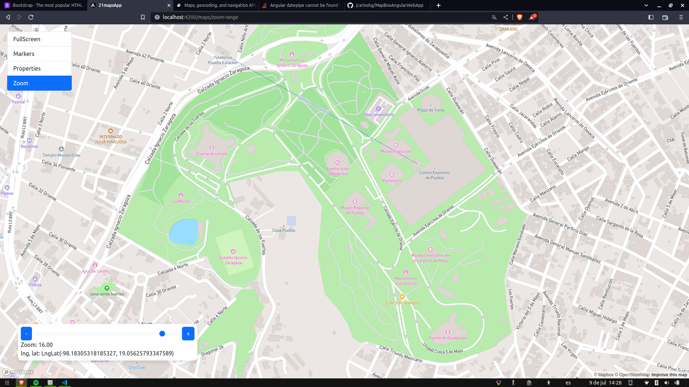

# Map Angular Web App 🗺️🌍

This project was [MapBox](https://www.mapbox.com/) and [Boostrap](https://getbootstrap.com/)

This project was generated with [Angular CLI](https://github.com/angular/angular-cli) version 15.2.5.

## Importan ⚠️
- Check `scripts` from `package.json`

## This project have 🪖
- StandAlone like pages
- StandAlone individual like component
- StandAlone individual component import into other StandAlone component
- StandAlone component import into module

## You can do...

- You can see the world in full screen 

- You can add markers and drop it 

- You can see play with the controls from zoom  